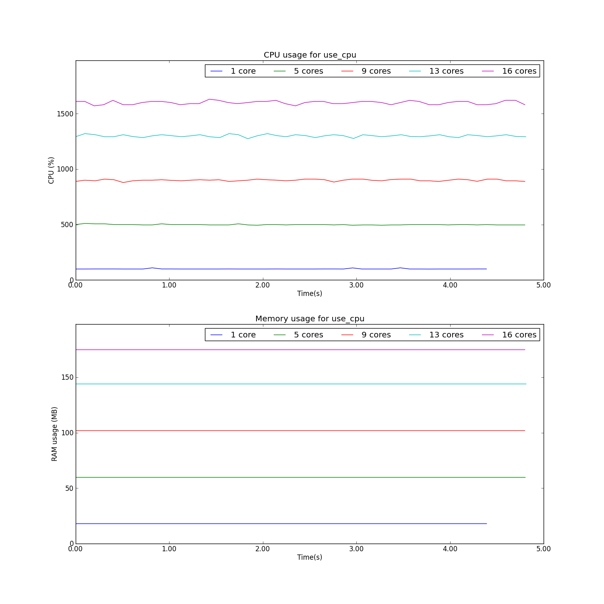
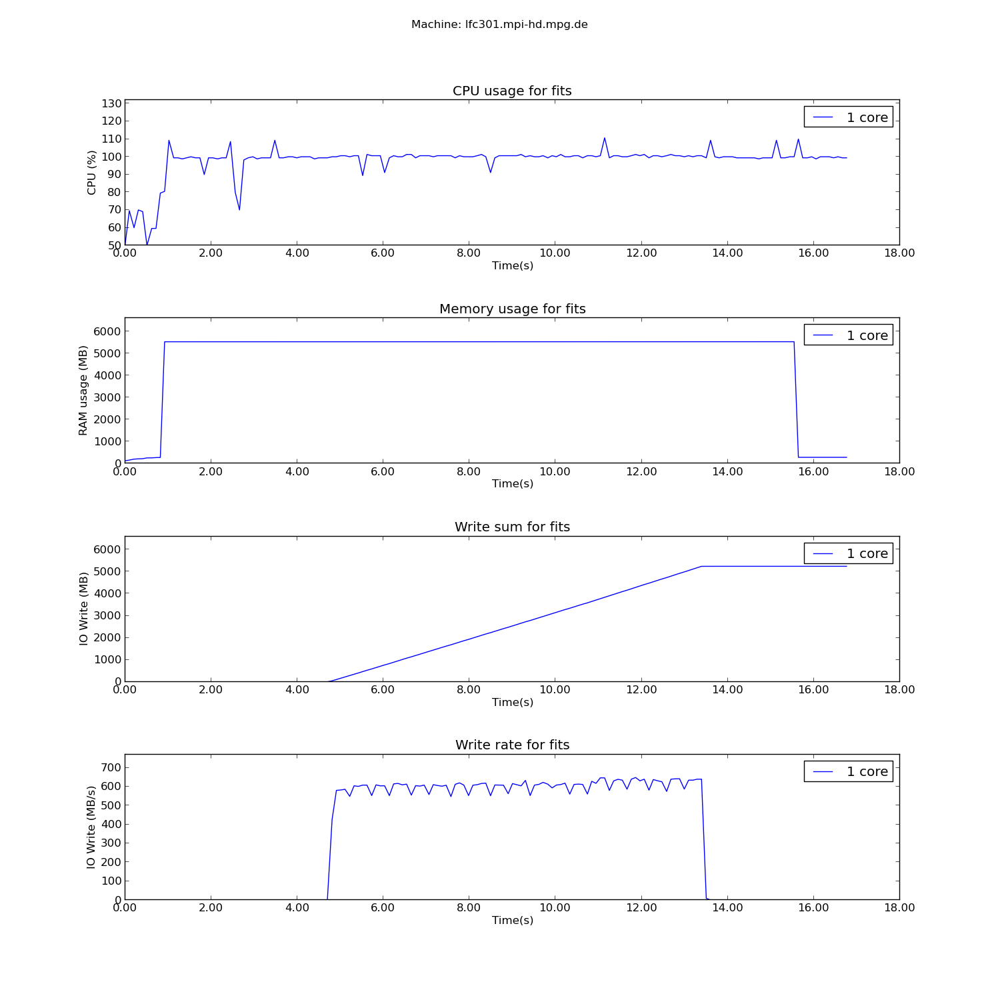
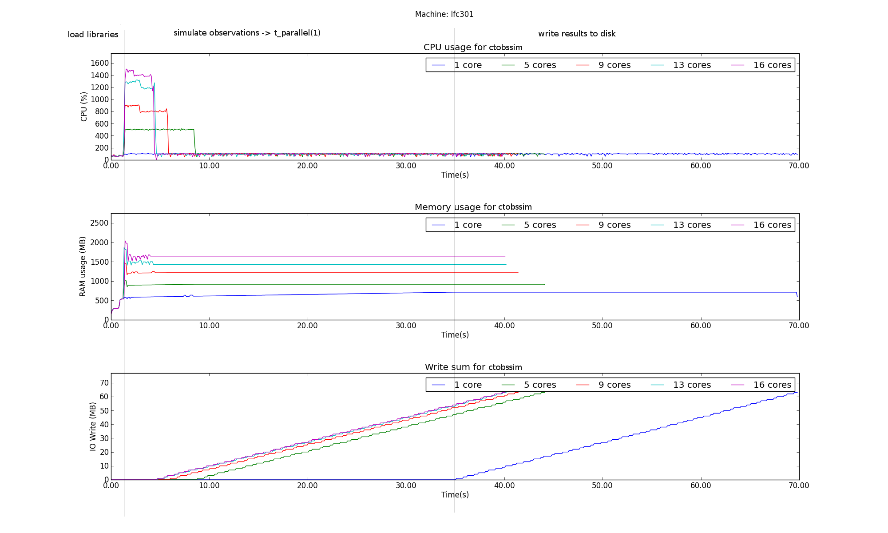
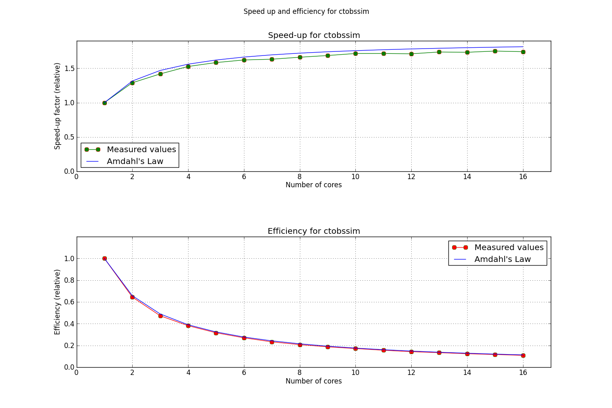
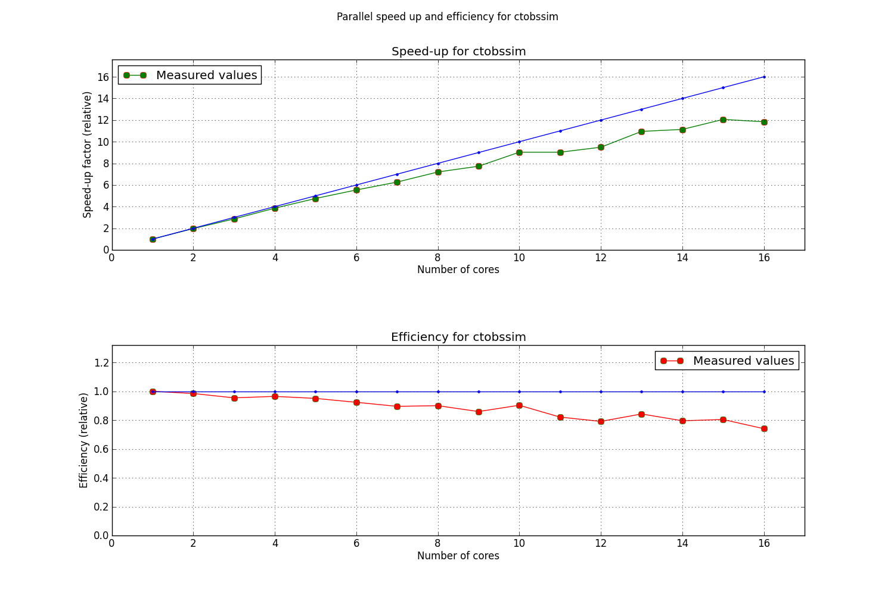
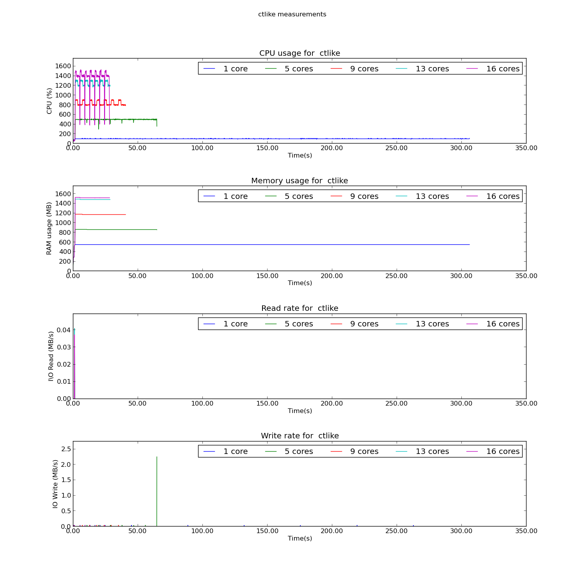
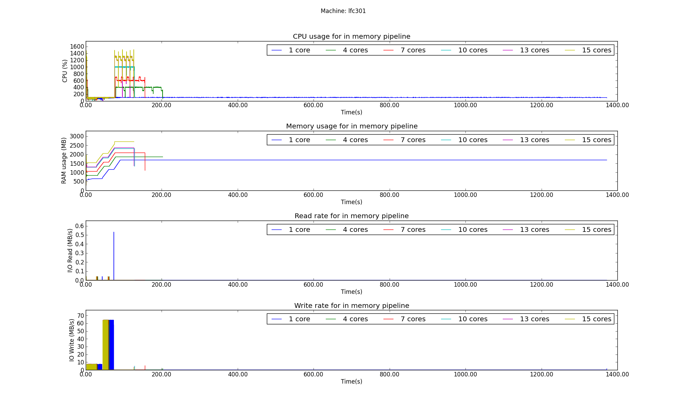
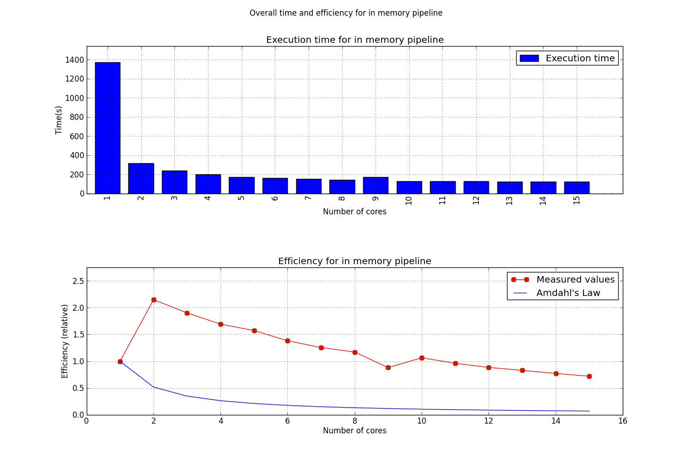

Results
*******

The results are structured in what was obtained for the measurements of ``ctobssim``, ``ctlike`` and the ``pipeline`` analysis. There is a brief introduction before each of these results are presented.

The parallel parts of the monitored functions have been parallelized using OpenMP_. Monitor was used to set the environment variable ``OMP_NUM_THREADS`` to different values in order to insure that the software could not access more than a specified number of cores. 

In order to get the time spent in the serial and parallel parts of the programme, logging statements were added to the source code, statements which logged the duration of the parallel portion. These values were then interpreted according to Amdahl's Law and the theoretical speedup was ploted together with the measured values.

``monitor`` checks
==================

Before the actual monitoring begins, a few simple test cases have been used to ee if the monitor actually does its job.

CPU usage test
--------------

The CPU usage test serves the purpose of testing if ``monitor`` can actually set the number of threads that the program is using i.e. if it correctly exports the ``OMP_NUM_THREADS`` variable correctly.

In pseudocode, the CPU test program looks like::

	#pragma omp parallel
	while (difftime(end,start) < interval)
		int a = 1 + 1;

This will create as many threads as the ``OMP_NUM_THREADS`` variable allows.

The results of running this through monitor are presented below.

   
As can be seen from the plots, the CPU usage is properly monitored when there are multiple cores being employed. A somewhat strange side effect is the increase in memory as the number of cores increases.

Disk I/O
--------

In order to test for disk I/O, a simple Python testcase was developed that simply wrote a large file to disk. In pseudocode, it would look like::

    def fits_gen(file_size):
        import numpy as np
        from astropy.io import fits

        data = np.zeros(file_size * 1024 ** 2 / 8)
        fits.writeto('data.fits', data=data, clobber=True)

The chosen filesize was 5 GB. Below, you can see the results of this measurement:

As can be seen from the plot, the cumulative write size is 5 GB and also the memory usage is about 5 GB, the extra coming from the libraries that need to be loaded. Therefore, the ``Monitor`` class and its methods yield accurate results when it comes to disk I/O.

ctobssim
========

Description
-----------

``ctobssim`` is a function from the ctools_ suite. It is used to simulate astronomical observations given certain input parameters. For more details about the possible input parameters, see the `official documentation <http://cta.irap.omp.eu/ctools/doc/ctobssim.html>`_.

The parallelism in ``ctobssim`` is realized at observation level. In short, this means that, in order to be able to see more than one CPU being used at a certain point in time, one needs to simulate more than one event. This is what we also did, as detailed in the next section.

In pseudocode, ``ctobssim`` looks like::

    model = read_model("model.xml")
    observations = read_observations("observations.xml")
    event_lists = make_empty_lists(observations.size())
     
    # omp parallel for
    for (i = 0; i < observations.size(); i++) 
        event_lists[i] = simulate_events(observation[i], model)

    for (i = 0; i < observations.size(); i++)
            event_lists[i].save_to_file()

Input data
----------
The input parameters for ctobssim were the following:

- **Astronomical model** Crab and Background 
- **Calibration database** ``$GAMMALIB/share/caldb/cta`` 
- **Instrument response function** ``cta_dummy_irf``
- **RA** 83.63 
- **DEC** 22.01 
- **Duration of observations** 5000 s 
- **Energy range** 0.1 - 100 TeV 
- **Number of simulated runs**  100  

Results
-------
The results for the measurements of ``ctobssim`` are presented below.

The vertical lines on the plots represent the limits of the parallel portion of the code for the execution on 1 core. This ``parallle_time(1)`` was then plugged into Amdahl's Law in order to obtain the predicted speedup of the process. 

The plots show that the serial part of the program and especially the part in which I/O is done is the most time consuming one. We can therefore assume that for a process with such long serial execution time, the speedup obtained from executing the process in parallel will not scale linearly.

Below is a plot of the overall speedup of the process.

As can be seen, the execution of ``ctobssim`` respects Amdahl's Law almost prefectly. 

A closer look to how the execution time of the parallel portions of the code scales with time reveals however that there is probably some overhead that does not allow a linear scaling with time.

ctlike
======

Description
-----------

``ctlike`` is another function from the ctools_ suite. It takes as input parameters a list of observations and it computes the maximum likelihood fit for that list of parameters. For more details about the possible input parameters, see the official ctlike_ 

The parallelism in ``ctlike`` is implemented again at observation level. 

In pseudocode, ``ctlike`` looks like::

    model = read_model("model.xml")
    observations = read_observations("observations.xml")
    data = read_data("data.xml")
    optimizer = make_optimizer(model, observations, data)
    optimizer.run()
    optimizer.model.save_to_file("fitted_model.xml")
    void Optimizer::run(){
            // détails not important here …
            // calls compute_likelihood() in a while loop
            // typically 100 to 1000 times until convergence is achieved
            while (..) 
                    this->guess_new_model_parameters()
                    this->compute_likelihood()                
    }
    
    void Optimizer::compute_likelihood(){ 
            likelihoods = std::vector<double>(this->observations.size())
            # omp parallel for
            for (i = 0; i < observations.size(); i++) 
                    // The per-observation likelihood is an expensive computation that
                    // could be further parallelized … but details are not important here
                    likelihoods[i] = compute_likelihood_for_one_observation(i)
            self->likelihood = likelihoods.sum()
    }

Input data
----------
- **Astronomical model** Crab and Background 
- **Source of data** ctobssim simulated runs
- **Events/run** 360
- **Analysis type** unbinned 
- **Energy range** 0.1 - 100 TeV 
- **Number of evaluated runs**  100  

Results
-------

The results for ``ctline`` are presented below.

As can be seen, even though ``ctlike`` is allowed to use for example 16 cores, it will only 14 or 15 cores for the simulation. This behaviour has not yet been properly explained.

   
As was expected, ``ctlike`` is doing almost no I/O at all. Another important point to note is that the biggest part of ``ctlike`` is parallelized so we can expect good speedups when using multiple cores.

The measured speedup does not conform with the value predicted by Amdahl's Law. However, it can be seen that the execution time is greatly reduced when using multiple cores. Further investigation is needed to see why the OpenMP parallelization fails to yield an ideal efficiency.

pipeline analysis
=================
Description
-----------
The pipeline analysis consists of different that are run consecutively. Thus, the events are simulated by ctobssim_, they are filled into enegy bins using ctbin_ and the maximum likelihood fit is computed using ctlike_.

The advantage of the pipeline is that it can run these events one after the other instead of separating the processes from one another. Another advantage is that the data can be stored in memory thus relinquishing the need to physically save the results to disk.

As before, parallel behaviour can be observed only when running the pipeline for more than one event. The parallelized portions of the code lie in ``ctobssim`` and ``ctlike`` while ctbin contains only serial code.

Input data
----------
The pipeline was run with the following input data:

- **Astronomical model** Crab and Background 
- **Calibration database** ``$GAMMALIB/share/caldb/cta`` 
- **Instrument response function** ``cta_dummy_irf``
- **Duration of observations** 5000 s 
- **Energy range** 0.1 - 100 TeV 
- **Number of simulated runs**  100  

Results
-------
The results of the in memory pipeline can be seen below.

As can be seen, the execution on a single core takes a lot more time than it does on multiple cores. This has a strong effect on the efficiency as can be seen in the next plot.

The multiple core execution time is much shorter than the single core time. This will lead to a measured efficiency greater than 1! It was not yet determined why this happens. Even though the pipeline analysis was run multiple times, it yielded similar results each time. 

.. _ctools: http://cta.irap.omp.eu/ctools/
.. _ctobssim: http://cta.irap.omp.eu/ctools/doc/ctobssim.html
.. _ctlike: http://cta.irap.omp.eu/ctools/doc/ctlike.html
.. _ctbin: http://cta.irap.omp.eu/ctools/doc/ctbin.html
.. _gammalib: http://gammalib.sourceforge.net/
.. _gamma-speed: https://github.com/gammapy/gamma-speed/
.. _OpenMP: http://en.wikipedia.org/wiki/OpenMP
